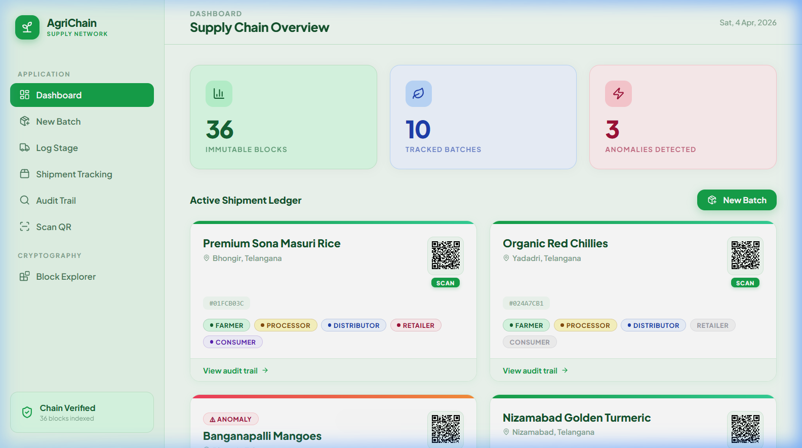
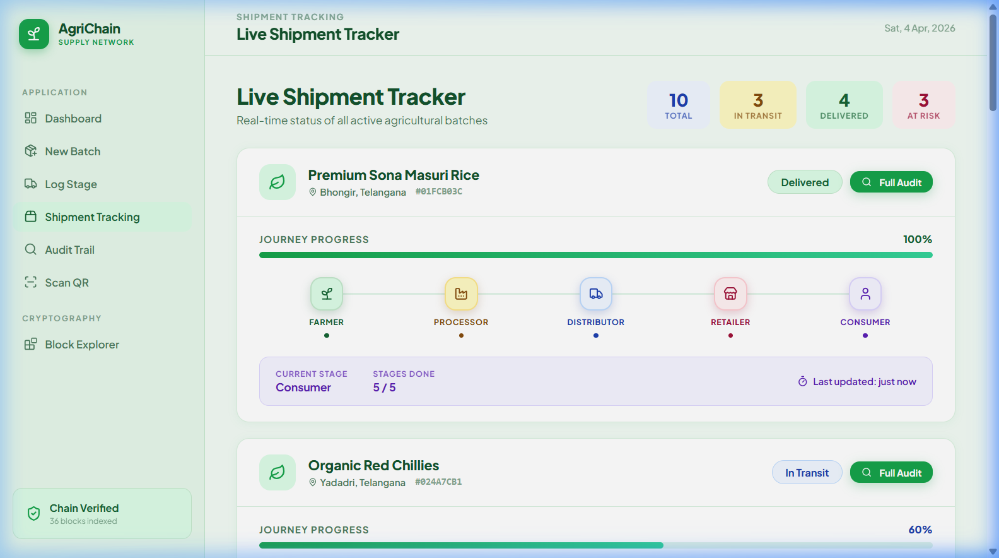
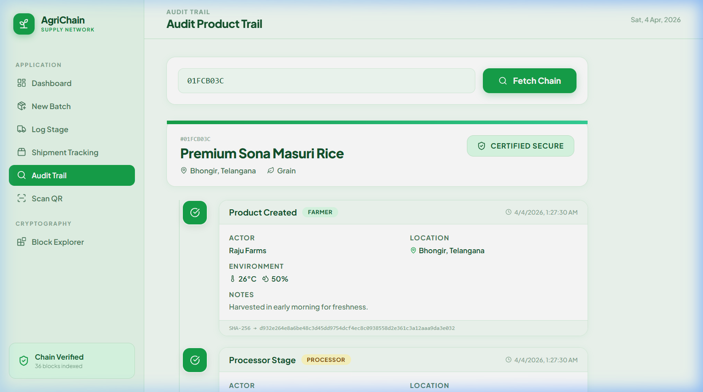
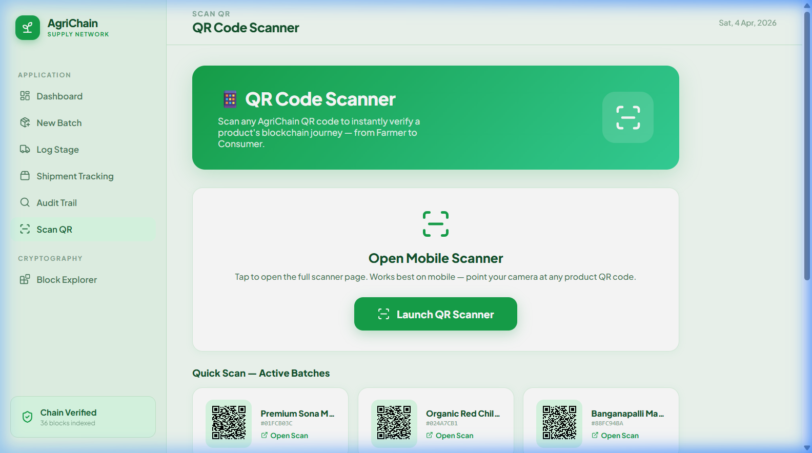
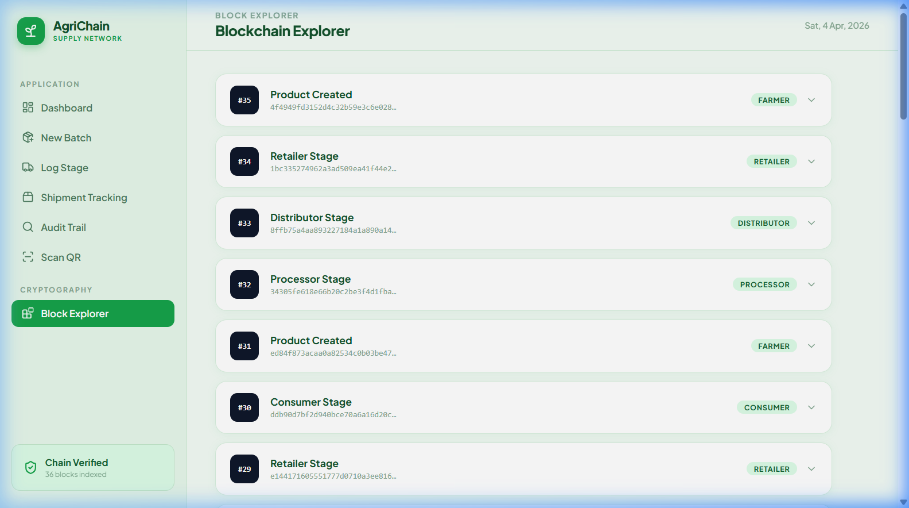

<div align="center">

# 🌿 AgriChain
### Blockchain-Based Agricultural Supply Chain Transparency

[](https://opensource.org/licenses/MIT)
[](https://www.mongodb.com/mern-stack)
[](https://render.com)
[](https://vercel.com)
[](https://nodejs.org/)
[](https://react.dev/)
[](https://www.mongodb.com/cloud/atlas)

<br/>

**AgriChain** is a production-grade MERN stack application that brings complete transparency to the agricultural supply chain using **immutable blockchain technology**. Every hand-off — from the farmer's field to the consumer's table — is permanently recorded, cryptographically secured, and instantly verifiable via QR code.

<br/>

[🚀 Live Dashboard](https://blockchain-based-supply-chain-trans.vercel.app/) &nbsp;·&nbsp;
[📱 Mobile Scanner](https://blockchain-based-supply-chain.onrender.com/scan.html) &nbsp;·&nbsp;
[⚙️ API Health](https://blockchain-based-supply-chain.onrender.com/api/test)

</div>

---

## 📸 Screenshots

### 🖥️ Dashboard — Supply Chain Overview


---

### 📦 Shipment Tracking — Live Journey Tracker


---

### 🔍 Audit Trail — Blockchain-Verified Product History


---

### 📷 Scan QR — Quick Scan Hub


---

### ⛓️ Block Explorer — Immutable Ledger View


---

> 💡 **Live at:** [blockchain-based-supply-chain-trans.vercel.app](https://blockchain-based-supply-chain-trans.vercel.app/)
>
> ⚠️ **Note:** Backend runs on Render's free tier — expect a ~30s cold-start on first request.

---

## ✨ Features

### 🔐 Immutable Blockchain Ledger
Every product batch is a **mini blockchain**. Each lifecycle stage (Farm → Processing → Distribution → Retail → Consumer) creates a new block cryptographically linked via **SHA-256 hashing** — guaranteeing tamper-proof data integrity that cannot be altered without detection.

### 📱 Dynamic QR Code Ecosystem
A unique QR code is generated at batch creation. Consumers scan it to instantly view the **complete farm-to-table journey** — origin, temperature logs, humidity records, actor names, and block hashes on a beautiful mobile page.

### 🌡️ Real-Time Anomaly Detection
Built-in environmental monitoring automatically flags batches that exceed safe temperature or humidity thresholds at any stage. Anomalies appear immediately on the dashboard with warning indicators.

### 📊 Live Operations Dashboard
A professional React dashboard with real-time supply chain KPIs:
- 📦 **Immutable Blocks** — Total length of the on-chain ledger
- 🌿 **Tracked Batches** — All active product batches in the system
- ⚡ **Anomalies Detected** — Batches with environmental breaches

### 🔍 Audit Trail & Shipment Tracking
- Full **Audit Trail** view with cryptographic SHA-256 hash displayed per block
- **Shipment Tracker** with a visual stepper (Farmer → Processor → Distributor → Retailer → Consumer) and journey progress percentage

### 🔗 Chain Integrity Verification
A `/api/verify` endpoint rehashes the entire chain on demand, validates every block's `previousHash` linkage, and returns a verified/compromised status — live in the sidebar.

### 📷 Dedicated QR Scanner Page
A standalone `scan.html` page (backend-served) with camera-based QR scanning support. Accessible from the **Scan QR** sidebar tab — lists all active batches with one-tap scan links.

---

## 🛠️ Technology Stack

| Layer | Technology | Purpose |
| :--- | :--- | :--- |
| **Frontend** | React 19 (Vite), Lucide Icons, QRCode.react | Dashboard UI & QR generation |
| **Styling** | Vanilla CSS-in-JS (inline styles) + Google Fonts | Premium green-themed UI design |
| **Backend** | Node.js 18+, Express.js | REST API server |
| **Database** | MongoDB Atlas (Mongoose ODM) | Persistent batch & ledger storage |
| **Blockchain** | Custom SHA-256 Linked-List Ledger | Immutable record keeping |
| **Mobile Scanner** | Vanilla HTML/JS (`scan.html`) + html5-qrcode | Consumer-facing QR scan page |
| **Deployment** | Vercel (Frontend) + Render (Backend) | Cloud hosting |

---

## 📦 Project Structure

```text
Blockchain-based-Supply-chain-Transparency-for-Agricultural-Procedure/
├── backend/
│   ├── config/
│   │   └── db.js                    # MongoDB Atlas connection
│   ├── controllers/
│   │   └── productController.js     # Business logic & SHA-256 hashing
│   ├── models/
│   │   ├── Product.js               # Core batch/product schema
│   │   ├── BlockchainTransaction.js # On-chain event schema
│   │   ├── Farmer.js                # Farmer entity schema
│   │   ├── Shipment.js              # Shipment record schema
│   │   └── User.js                  # User/actor schema
│   ├── routes/
│   │   └── productRoutes.js         # All Express API route definitions
│   ├── server.js                    # App entry point, middleware, static serving
│   └── seed.js                      # Script to populate DB with demo data
├── frontend/
│   ├── src/
│   │   ├── App.jsx                  # Root React component (all views/tabs)
│   │   ├── main.jsx                 # React DOM entry point
│   │   └── index.css                # Global styles
│   ├── public/                      # Static assets (favicon, icons)
│   ├── index.html                   # HTML shell
│   ├── vite.config.js               # Vite build configuration
│   └── vercel.json                  # Vercel SPA rewrite rules
└── templates/
    └── scan.html                    # Mobile-optimized QR scan & journey viewer
```

---

## 🚀 Local Setup & Installation

### Prerequisites
- [Node.js v18+](https://nodejs.org/)
- [npm v9+](https://www.npmjs.com/)
- A [MongoDB Atlas](https://www.mongodb.com/cloud/atlas) cluster (free tier is fine)

### 1. Clone the Repository
```bash
git clone https://github.com/FenixDevOps/Blockchain-based-Supply-chain-Transparency-for-Agricultural-Procedure.git
cd Blockchain-based-Supply-chain-Transparency-for-Agricultural-Procedure
```

### 2. Backend Setup
```bash
cd backend
npm install
```

Create a `.env` file inside `backend/`:
```env
MONGODB_URI=mongodb+srv://<user>:<password>@cluster.mongodb.net/agrichain
PORT=5000
```

Start the backend server:
```bash
# Development (with hot-reload via nodemon)
npm run dev

# Production
npm start
```

✅ API will be live at `http://localhost:5000`

### 3. Frontend Setup
```bash
cd frontend
npm install
```

Create a `.env` file inside `frontend/`:
```env
VITE_API_URL=http://localhost:5000/api
```

Start the Vite dev server:
```bash
npm run dev
```

✅ Dashboard will be live at `http://localhost:5173`

### 4. Seed Demo Data (Optional)
Populate your MongoDB with realistic agricultural batch data for testing:
```bash
cd backend
node seed.js
```

---

## 📜 API Reference

**Base URL:** `https://blockchain-based-supply-chain.onrender.com`

### 🥬 Products & Batches

| Method | Endpoint | Description |
| :--- | :--- | :--- |
| `GET` | `/api/products` | Retrieve all tracked batches |
| `POST` | `/api/products` | Register a new batch (writes Genesis Block) |
| `POST` | `/api/products/:batchId/stage` | Append a new lifecycle stage |
| `GET` | `/api/products/:batchId/trace` | Fetch full blockchain journey for a batch |

### 📊 Chain & Dashboard

| Method | Endpoint | Description |
| :--- | :--- | :--- |
| `GET` | `/api/stats` | Dashboard KPIs (total blocks, batches, anomalies) |
| `GET` | `/api/chain` | Retrieve the entire ledger chain |
| `GET` | `/api/verify` | Cryptographically validate full chain integrity |

### 📱 QR Tracking

| Method | Endpoint | Description |
| :--- | :--- | :--- |
| `GET` | `/api/trace/:batchId` | Full trace data for mobile scan page |

### 🔧 Utility

| Method | Endpoint | Description |
| :--- | :--- | :--- |
| `GET` | `/api/test` | Backend health check with timestamp |
| `GET` | `/health` | Server liveness probe |

---

## 📱 QR Scanner Flow

```
1. Register Batch   ──►  Genesis Block written to MongoDB
        │
        ▼
2. QR Code Generated ──►  Encodes: scan.html?batch=<batchId>
        │
        ▼
3. Consumer Scans QR ──►  scan.html fetches /api/trace/:batchId
        │
        ▼
4. Mobile Page Renders ──►  Full farm-to-table blockchain journey
                             (actor · location · temp · humidity · hash)
```

**Access via:**
- Dashboard card → click green **SCAN** badge under any QR code
- Sidebar → **Scan QR** tab → pick any batch or launch the camera scanner
- Direct URL: `https://blockchain-based-supply-chain.onrender.com/scan.html`

---

## 🔒 Blockchain Architecture

Each product maintains an internal linked-list chain of stage blocks:

```
┌─────────────────────────────┐
│  Genesis Block (Farmer)     │
│  hash:         SHA256(data) │
│  previousHash: "0"          │
└─────────────┬───────────────┘
              │
┌─────────────▼───────────────┐
│  Block 2 (Processor)        │
│  hash:         SHA256(data) │
│  previousHash: hash(Block1) │
└─────────────┬───────────────┘
              │
┌─────────────▼───────────────┐
│  Block 3 (Distributor)      │
│  hash:         SHA256(data) │
│  previousHash: hash(Block2) │
└─────────────┬───────────────┘
              │
┌─────────────▼───────────────┐
│  Block 4 (Retailer)         │
│  hash:         SHA256(data) │
│  previousHash: hash(Block3) │
└─────────────────────────────┘
```

**Each block stores:**
`stage` · `actor` · `location` · `temperature_c` · `humidity_pct` · `timestamp` · `notes` · `hash` · `previousHash`

Chain integrity is validated by re-computing every block's SHA-256 hash and verifying `previousHash` linkage across the full chain.

---

## 🌐 Deployment

### Frontend → Vercel
1. Push to GitHub
2. Connect repo to [Vercel](https://vercel.com)
3. Set **Root Directory** → `frontend`
4. Add environment variable: `VITE_API_URL=https://blockchain-based-supply-chain.onrender.com/api`
5. Vercel auto-deploys on every `git push`

```bash
# Manual build
cd frontend
npm run build
```

### Backend → Render
1. Connect GitHub repo to [Render](https://render.com)
2. **Root Directory:** `backend`
3. **Build Command:** `npm install`
4. **Start Command:** `npm start`
5. Add environment variables in Render dashboard:
   - `MONGODB_URI` — your MongoDB Atlas connection string
   - `PORT` — `5000` (or leave for Render default)

---

## 🤝 Contributing

Contributions are welcome! Here's how:

1. Fork the repository
2. Create a feature branch: `git checkout -b feature/your-feature`
3. Commit your changes: `git commit -m 'feat: add your feature'`
4. Push: `git push origin feature/your-feature`
5. Open a Pull Request

Please follow conventional commits format and ensure code is clean before submitting.

---

## 📄 License

This project is licensed under the **MIT License** — see the [LICENSE](LICENSE) file for details.

---

## 👨‍💻 Credits & Author

<div align="center">

### Built with  by **Manikanta**

| | |
|:---:|:---|
| 👤 | **Manikanta** |
| 🎓 | Full Stack Developer |
| 🔗 | [GitHub: FenixDevOps](https://github.com/FenixDevOps) |
| 💡 | Designed & developed the entire AgriChain platform — blockchain architecture, MERN stack backend, React dashboard, mobile QR scanner, and cloud deployment |

<br/>

> *"Bringing trust and transparency to every grain of rice, every mango, every chilli — from the farmer's hands to your table."*

<br/>

[](https://github.com/FenixDevOps)
[](https://blockchain-based-supply-chain-trans.vercel.app/)

<br/>

**🌿 AgriChain — For a Transparent & Trustworthy Food System**

</div>
